# myrs

[Design Doc](./docs/00_design.md)

## スクショ

### ログイン画面
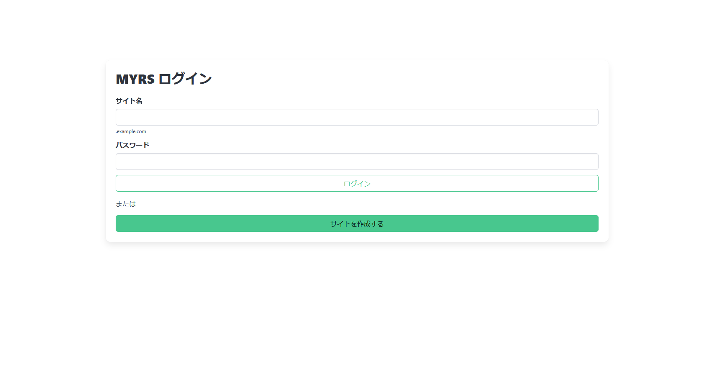

### サイト作成画面
Gitリポジトリは`https://`で公開されている必要があります。
また、リポジトリの`www/{パス}`のディレクトリがデプロイされます。

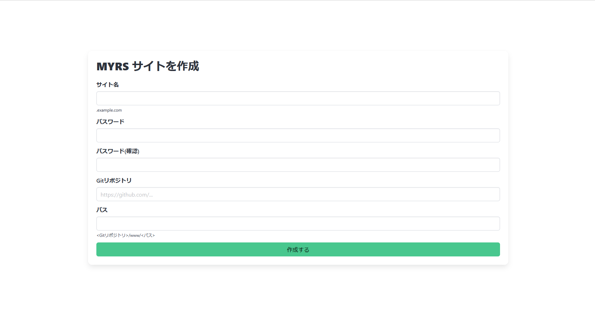

### サイトダッシュボード

サイトを作成した状態ではまだデプロイされていないため、デプロイを作成するボタンを押下する必要があります。
ログを閲覧する場合は、Logsボタンを押下します。

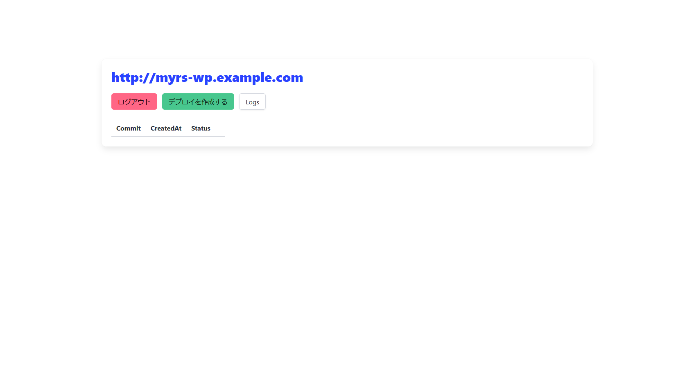

#### デプロイを作成する

最新のコミットを取得し `www/{パス}`の内容をコピーします。

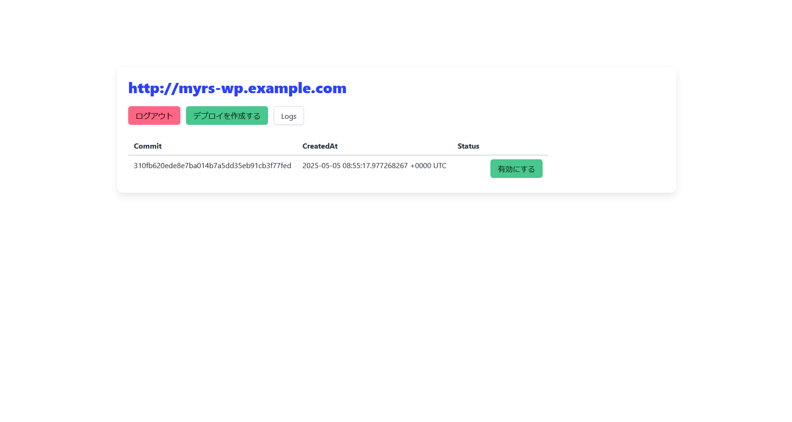

#### 有効にする

シンボリックリンクを作成し公開します。
　
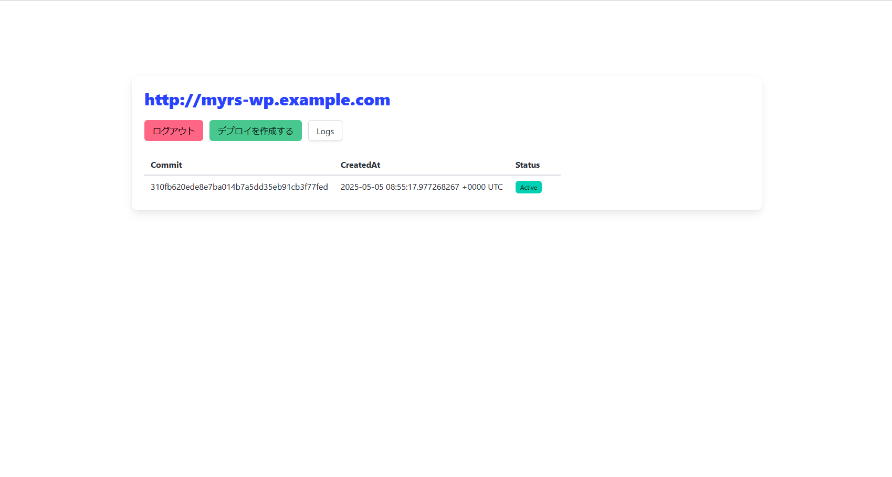

### デプロイされたWordPressにアクセスする

#### wordpressのセットアップ画面が表示される

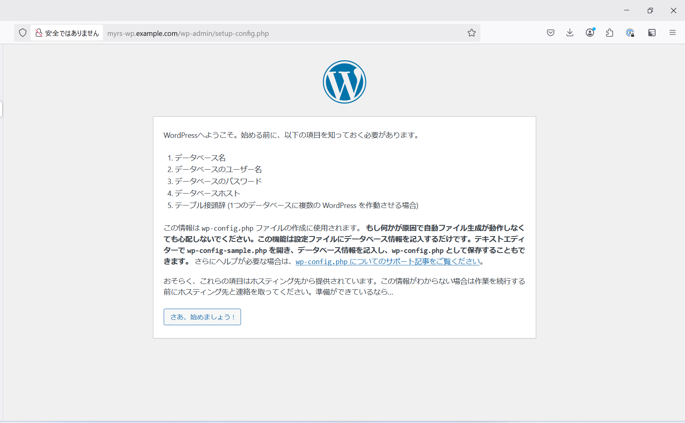

#### データベース情報を入力

サイトを作成するとサイト名のDBとユーザーが用意されており、auth_socketで認証するためパスワードなしで接続できます。

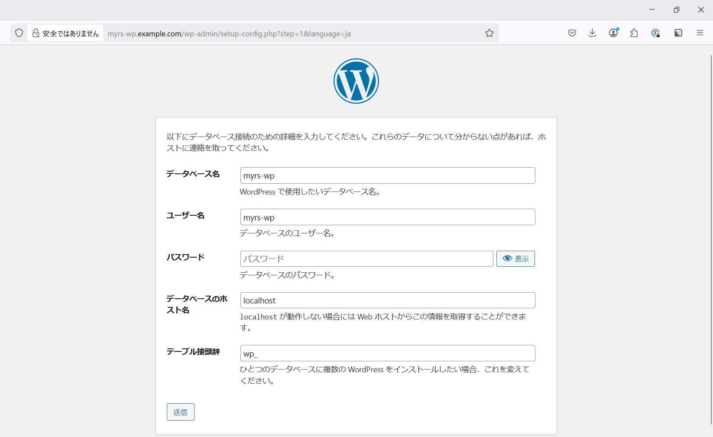

#### ブログ情報を入力

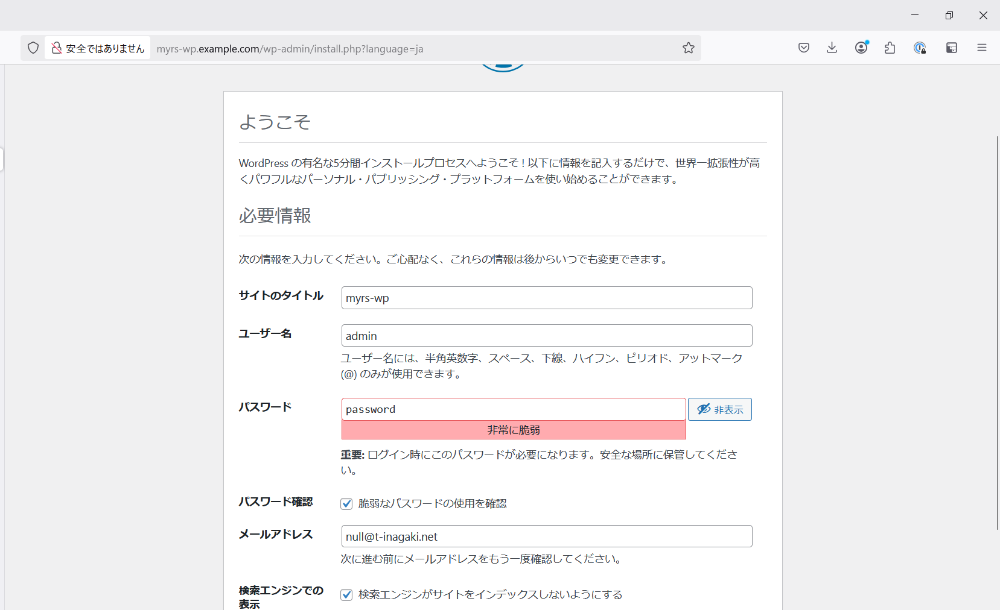

#### WordPressにログイン

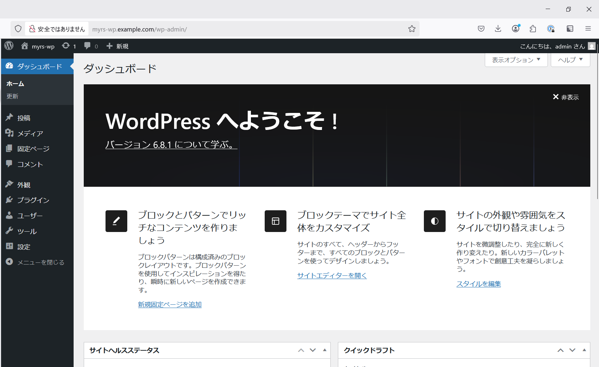

#### 記事を書く

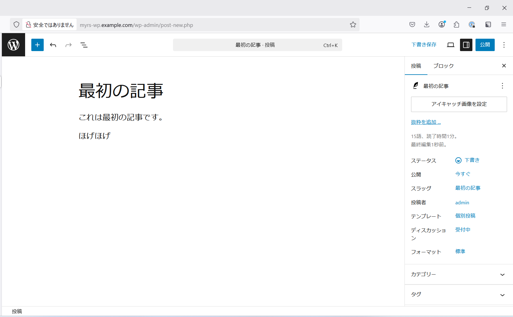

#### 記事を見る

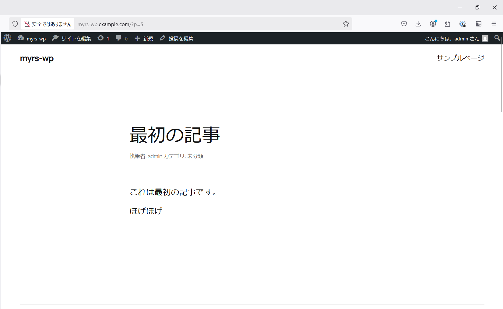

### ログを見る

サイトダッシュボードのLogsボタンからログページに遷移できます。
グラフは1分間のリクエスト数を１時間分表示しています。

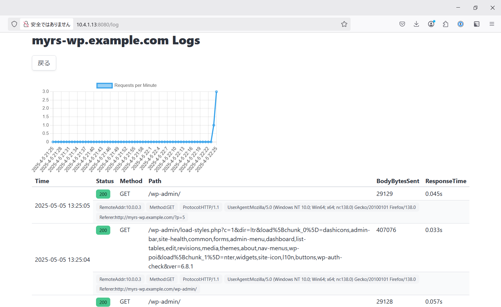