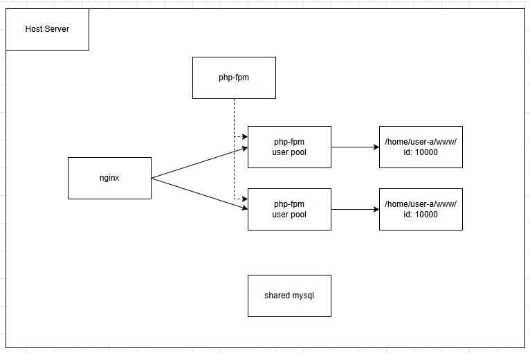

# Design Doc

日付: 2025-05-03

シンプルなレンタルサーバーを作る

## 要件
### 必須要件

- マルチテナント
    - ほかのユーザーのファイルを閲覧したり操作したりできないようにする
- WordPressが動く
    - MySQL
- FTPなどでデータをアップロードできる

### 追加要件

- WebUI
- バージョン管理

### 制限事項

- Dockerなどのコンテナを利用しない

## 基本設計

- nginx+php-fpm構成
- HTML/CSS/Imageなどの静的ファイルはnginxのVirtualHostで処理し、PHPはphp-fpmのsocketにproxyする
- テナント毎にphp-fpmのpoolを作成する
    - poolのユーザー・グループをテナントのユーザー・グループにすることでrootや共通ユーザーでのphp実行を防ぐ
- MySQLは共用とする
- MySQLはWebサーバーやphp-fpmと同じサーバーで稼働することを前提とする
    - localhostからのアクセスのみで外部からのアクセスを考慮しない
- WebUIで登録ができ、ファイルをアップロードできる
- 解約は考慮しない
- 独自ドメインは考慮しない

## 検証

### webサーバー+PHP
[nginx php-fpmの検証](./10_nginx-php-fpm.md)の通り権限を分離してサービスを提供できることが分かった。

### MySQL

[mysql検証](./20_mysql.md)の通りデータベースを作成し、専用のユーザーを作成することで共用できることが分かった。
また、[nginx php-fpmの検証](./10_nginx-php-fpm.md)の構成と併せてWordPressでも利用できることが分かった。

## レンサバを契約したときの処理の流れ

1. Linuxユーザーを作成する (useradd)
2. ホームディレクトリに `www`ディレクトリを作成する
3. ホームディレクトリと `www`ディレクトリの所有グループをwww-dataにする
4. /etc/php/8.3/fpm/pool.d/にユーザー用の設定を追加する
5. /etc/nginx/conf.d/にユーザー用の設定を追加する
6. php-fpmをreloadする
7. nginxをreloadする
8. MySQLにユーザー名のデータベースとユーザーを追加しauth_socketで権限を付与する

これらをプログラムで行えるようにしWebUIと連携できるとよさそう。

以下の4つプログラムがあるとよさそう。
- 1~3をやるプログラム
- 4, 6をやるプログラム
- 5, 7をやるプログラム
- 8をやるプログラム

## 懸念点

- htaccessが使えないので、ファイルが存在しない場合にindex.phpを利用する設定をnginxに入れる必要がある
    - permalinkが基本 (クエリ)なら問題はない
    - `http://user-a.example.com/wordpress/2025/05/03/sample-post/`のようなものにする場合はindex.phpに処理が行くようにしないといけない

permalinkがデフォルトで基本なのでいったん考慮しない。

## WebUI

- サイト作成画面
    - 実質的なユーザーとする
    - 1ユーザー1サイトとして1ユーザー複数サイトは考慮しない
    - サイトパスワード的なのを登録する

- サイト詳細画面
    - 何かしら情報が見れるとよさそう
    - とりあえずデータアップロード機能がある

### 技術

候補

- Go+template/html
- Go+React
- Laravel+React
- Django

経験値的にはGo+React or template/html, やりたいモノ的にはLaravel+React...
興味的にはDjango。

時間的にあと2日しかないので、手数が多いSPA＋API構成はやめておいたほうがよさそうか。

完成を優先してGo+template/htmlでやる

その他技術

- WebFramework
    - Echo
        - Ginと比べてerrorを返せるところがよい
        - net/httpのMuxは軽量すぎてつらい
    
- DBアクセス
    - GORM
        - とりあえずSQLを書かずにDB操作できればいいのでGORM
        - 型安全にさわるならgorm.io/genを使うかEntを利用するのがよさそうだが、使ったことないのでいったん考えない

## git deploy機能

ファイルアップロード機能作るの面倒なのでgit pullしてデプロイする機能を作る

- gitURL, tag, deployKeyを管理する
- git archiveでtar.gzでDownloadし、`~/deploys/{tag}/` に展開しシンボリックリンクを作成する (シンボリックリンクは `~/www -> ../deploys/{tag}`)
    - git archiveでremote(github)から取得するのはできないっぽいのでgit cloneして wwwディレクトリをコピーするという仕様にする
    - cloneしてarchiveして.gitを含まないというようにでもできるけど、ほかにも公開されたくないファイル含まれてることあることを考えると明示的に公開ディレクトリを決めておくのがよい気がした。

- デプロイを作成するとHEADをcloneしてコピーする
- 有効にするボタンでそのデプロイにシンボリックリンクを作成し切り替える
    - そのため、アプリケーションが画像ファイルなどを保存している場合は引き継がれない
    - ディレクトリごと永続化する場合はloopback deviceなどを作成しマウントしておくとよさそう
    - ファイルを永続化するのは面倒なので、任意のファイルをアップロードできる機能を作るとよさそう
        - 設定ファイルなど
        - wp-config.php
            - ファイルアップロード機能でwp-config.phpの内容を ~/files/wp-config.php のように保存しておき、git管理しているwordpressのwp-config.phpではそれをincludeする `<?php include('../files/wp-config.php'); `
    - なお時間がないので永続化機能は作らない