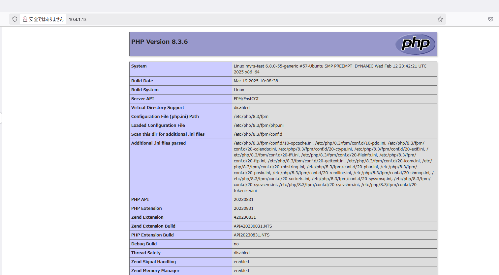
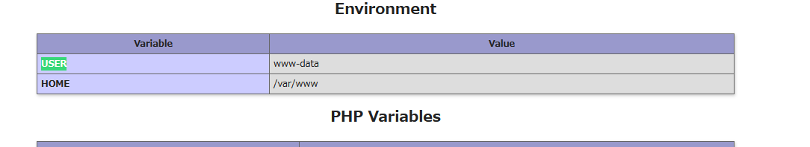
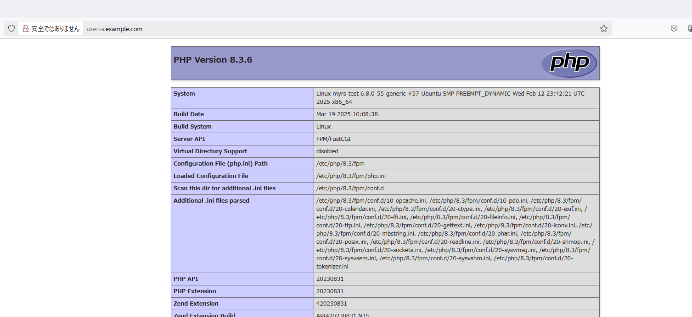
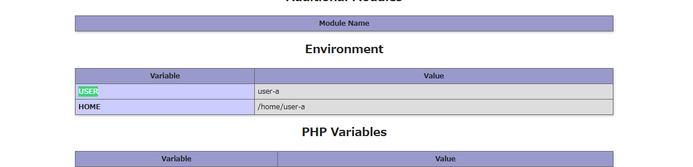
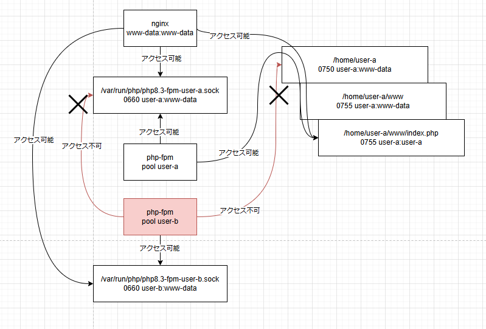

# nginx php-fpmの検証

nginxとphp-fpmを導入してみて実行ユーザーを分離できるか検証する。

## 検証環境

- LXD/LXC
- Ubuntu 24.04

## nginxをインストール

```
sudo apt update
sudo apt install nginx
```

```
root@myrs-test:~# apt update
Get:1 http://security.ubuntu.com/ubuntu noble-security InRelease [126 kB]
Hit:2 http://archive.ubuntu.com/ubuntu noble InRelease
Get:3 http://archive.ubuntu.com/ubuntu noble-updates InRelease [126 kB]
Get:4 http://archive.ubuntu.com/ubuntu noble-backports InRelease [126 kB]
Get:5 http://security.ubuntu.com/ubuntu noble-security/main amd64 Packages [782 kB]
Get:6 http://archive.ubuntu.com/ubuntu noble/universe amd64 Packages [15.0 MB]
Get:7 http://security.ubuntu.com/ubuntu noble-security/main amd64 Components [21.6 kB]
Get:8 http://security.ubuntu.com/ubuntu noble-security/universe amd64 Packages [833 kB]
Get:9 http://security.ubuntu.com/ubuntu noble-security/universe Translation-en [181 kB]
Get:10 http://security.ubuntu.com/ubuntu noble-security/universe amd64 Components [52.2 kB]
Get:11 http://security.ubuntu.com/ubuntu noble-security/universe amd64 c-n-f Metadata [17.0 kB]
Get:12 http://security.ubuntu.com/ubuntu noble-security/restricted amd64 Components [212 B]
Get:13 http://security.ubuntu.com/ubuntu noble-security/multiverse amd64 Packages [17.6 kB]
Get:14 http://security.ubuntu.com/ubuntu noble-security/multiverse Translation-en [3792 B]
Get:15 http://security.ubuntu.com/ubuntu noble-security/multiverse amd64 Components [212 B]
Get:16 http://security.ubuntu.com/ubuntu noble-security/multiverse amd64 c-n-f Metadata [380 B]
Get:17 http://archive.ubuntu.com/ubuntu noble/universe Translation-en [5982 kB]
Get:18 http://archive.ubuntu.com/ubuntu noble/universe amd64 Components [3871 kB]
Get:19 http://archive.ubuntu.com/ubuntu noble/universe amd64 c-n-f Metadata [301 kB]
Get:20 http://archive.ubuntu.com/ubuntu noble/multiverse amd64 Packages [269 kB]
Get:21 http://archive.ubuntu.com/ubuntu noble/multiverse Translation-en [118 kB]
Get:22 http://archive.ubuntu.com/ubuntu noble/multiverse amd64 Components [35.0 kB]
Get:23 http://archive.ubuntu.com/ubuntu noble/multiverse amd64 c-n-f Metadata [8328 B]
Get:24 http://archive.ubuntu.com/ubuntu noble-updates/main amd64 Packages [1057 kB]
Get:25 http://archive.ubuntu.com/ubuntu noble-updates/main Translation-en [227 kB]
Get:26 http://archive.ubuntu.com/ubuntu noble-updates/main amd64 Components [161 kB]
Get:27 http://archive.ubuntu.com/ubuntu noble-updates/universe amd64 Packages [1060 kB]
Get:28 http://archive.ubuntu.com/ubuntu noble-updates/universe Translation-en [268 kB]
Get:29 http://archive.ubuntu.com/ubuntu noble-updates/universe amd64 Components [377 kB]
Get:30 http://archive.ubuntu.com/ubuntu noble-updates/universe amd64 c-n-f Metadata [26.0 kB]
Get:31 http://archive.ubuntu.com/ubuntu noble-updates/restricted amd64 Packages [1062 kB]
Get:32 http://archive.ubuntu.com/ubuntu noble-updates/restricted Translation-en [220 kB]
Get:33 http://archive.ubuntu.com/ubuntu noble-updates/restricted amd64 Components [212 B]
Get:34 http://archive.ubuntu.com/ubuntu noble-updates/multiverse amd64 Packages [21.7 kB]
Get:35 http://archive.ubuntu.com/ubuntu noble-updates/multiverse Translation-en [4788 B]
Get:36 http://archive.ubuntu.com/ubuntu noble-updates/multiverse amd64 Components [940 B]
Get:37 http://archive.ubuntu.com/ubuntu noble-updates/multiverse amd64 c-n-f Metadata [592 B]
Get:38 http://archive.ubuntu.com/ubuntu noble-backports/main amd64 Packages [39.1 kB]
Get:39 http://archive.ubuntu.com/ubuntu noble-backports/main Translation-en [8676 B]
Get:40 http://archive.ubuntu.com/ubuntu noble-backports/main amd64 Components [7064 B]
Get:41 http://archive.ubuntu.com/ubuntu noble-backports/main amd64 c-n-f Metadata [272 B]
Get:42 http://archive.ubuntu.com/ubuntu noble-backports/universe amd64 Packages [27.1 kB]
Get:43 http://archive.ubuntu.com/ubuntu noble-backports/universe Translation-en [16.5 kB]
Get:44 http://archive.ubuntu.com/ubuntu noble-backports/universe amd64 Components [16.3 kB]
Get:45 http://archive.ubuntu.com/ubuntu noble-backports/universe amd64 c-n-f Metadata [1304 B]
Get:46 http://archive.ubuntu.com/ubuntu noble-backports/restricted amd64 Components [216 B]
Get:47 http://archive.ubuntu.com/ubuntu noble-backports/restricted amd64 c-n-f Metadata [116 B]
Get:48 http://archive.ubuntu.com/ubuntu noble-backports/multiverse amd64 Components [212 B]
Get:49 http://archive.ubuntu.com/ubuntu noble-backports/multiverse amd64 c-n-f Metadata [116 B]
Fetched 32.5 MB in 5s (6162 kB/s)
Reading package lists... Done
Building dependency tree... Done
Reading state information... Done
All packages are up to date.
root@myrs-test:~# apt install nginx
Reading package lists... Done
Building dependency tree... Done
Reading state information... Done
The following additional packages will be installed:
  nginx-common
Suggested packages:
  fcgiwrap nginx-doc ssl-cert
The following NEW packages will be installed:
  nginx nginx-common
0 upgraded, 2 newly installed, 0 to remove and 0 not upgraded.
Need to get 551 kB of archives.
After this operation, 1596 kB of additional disk space will be used.
Do you want to continue? [Y/n] y
Get:1 http://archive.ubuntu.com/ubuntu noble-updates/main amd64 nginx-common all 1.24.0-2ubuntu7.3 [31.2 kB]
Get:2 http://archive.ubuntu.com/ubuntu noble-updates/main amd64 nginx amd64 1.24.0-2ubuntu7.3 [520 kB]
Fetched 551 kB in 1s (382 kB/s)
Preconfiguring packages ...
Selecting previously unselected package nginx-common.
(Reading database ... 37324 files and directories currently installed.)
Preparing to unpack .../nginx-common_1.24.0-2ubuntu7.3_all.deb ...
Unpacking nginx-common (1.24.0-2ubuntu7.3) ...
Selecting previously unselected package nginx.
Preparing to unpack .../nginx_1.24.0-2ubuntu7.3_amd64.deb ...
Unpacking nginx (1.24.0-2ubuntu7.3) ...
Setting up nginx (1.24.0-2ubuntu7.3) ...
Setting up nginx-common (1.24.0-2ubuntu7.3) ...
Created symlink /etc/systemd/system/multi-user.target.wants/nginx.service → /usr/lib/systemd/system/nginx.service.
Processing triggers for ufw (0.36.2-6) ...
Processing triggers for man-db (2.12.0-4build2) ...
Scanning processes...                                                                                                   
No services need to be restarted.

No containers need to be restarted.

No user sessions are running outdated binaries.

No VM guests are running outdated hypervisor (qemu) binaries on this host.
```

## php, php-fpmをインストール

```
sudo apt install php8.3 php8.3-mbstring php8.3-fpm
```

```
root@myrs-test:~# sudo apt install php8.3 php8.3-mbstring php8.3-fpm
Reading package lists... Done
Building dependency tree... Done
Reading state information... Done
The following additional packages will be installed:
  php-common php8.3-cli php8.3-common php8.3-opcache php8.3-readline
Suggested packages:
  php-pear
The following NEW packages will be installed:
  php-common php8.3 php8.3-cli php8.3-common php8.3-fpm php8.3-mbstring php8.3-opcache php8.3-readline
0 upgraded, 8 newly installed, 0 to remove and 0 not upgraded.
Need to get 5499 kB of archives.
After this operation, 23.8 MB of additional disk space will be used.
Do you want to continue? [Y/n] y
Get:1 http://archive.ubuntu.com/ubuntu noble/main amd64 php-common all 2:93ubuntu2 [13.9 kB]
Get:2 http://archive.ubuntu.com/ubuntu noble-updates/main amd64 php8.3-common amd64 8.3.6-0ubuntu0.24.04.4 [740 kB]
Get:3 http://archive.ubuntu.com/ubuntu noble-updates/main amd64 php8.3-opcache amd64 8.3.6-0ubuntu0.24.04.4 [372 kB]
Get:4 http://archive.ubuntu.com/ubuntu noble-updates/main amd64 php8.3-readline amd64 8.3.6-0ubuntu0.24.04.4 [13.5 kB]
Get:5 http://archive.ubuntu.com/ubuntu noble-updates/main amd64 php8.3-cli amd64 8.3.6-0ubuntu0.24.04.4 [1915 kB]
Get:6 http://archive.ubuntu.com/ubuntu noble-updates/universe amd64 php8.3-fpm amd64 8.3.6-0ubuntu0.24.04.4 [1925 kB]
Get:7 http://archive.ubuntu.com/ubuntu noble-updates/main amd64 php8.3 all 8.3.6-0ubuntu0.24.04.4 [9172 B]
Get:8 http://archive.ubuntu.com/ubuntu noble-updates/main amd64 php8.3-mbstring amd64 8.3.6-0ubuntu0.24.04.4 [512 kB]
Fetched 5499 kB in 3s (2003 kB/s)
Selecting previously unselected package php-common.
(Reading database ... 37372 files and directories currently installed.)
Preparing to unpack .../0-php-common_2%3a93ubuntu2_all.deb ...
Unpacking php-common (2:93ubuntu2) ...
Selecting previously unselected package php8.3-common.
Preparing to unpack .../1-php8.3-common_8.3.6-0ubuntu0.24.04.4_amd64.deb ...
Unpacking php8.3-common (8.3.6-0ubuntu0.24.04.4) ...
Selecting previously unselected package php8.3-opcache.
Preparing to unpack .../2-php8.3-opcache_8.3.6-0ubuntu0.24.04.4_amd64.deb ...
Unpacking php8.3-opcache (8.3.6-0ubuntu0.24.04.4) ...
Selecting previously unselected package php8.3-readline.
Preparing to unpack .../3-php8.3-readline_8.3.6-0ubuntu0.24.04.4_amd64.deb ...
Unpacking php8.3-readline (8.3.6-0ubuntu0.24.04.4) ...
Selecting previously unselected package php8.3-cli.
Preparing to unpack .../4-php8.3-cli_8.3.6-0ubuntu0.24.04.4_amd64.deb ...
Unpacking php8.3-cli (8.3.6-0ubuntu0.24.04.4) ...
Selecting previously unselected package php8.3-fpm.
Preparing to unpack .../5-php8.3-fpm_8.3.6-0ubuntu0.24.04.4_amd64.deb ...
Unpacking php8.3-fpm (8.3.6-0ubuntu0.24.04.4) ...
Selecting previously unselected package php8.3.
Preparing to unpack .../6-php8.3_8.3.6-0ubuntu0.24.04.4_all.deb ...
Unpacking php8.3 (8.3.6-0ubuntu0.24.04.4) ...
Selecting previously unselected package php8.3-mbstring.
Preparing to unpack .../7-php8.3-mbstring_8.3.6-0ubuntu0.24.04.4_amd64.deb ...
Unpacking php8.3-mbstring (8.3.6-0ubuntu0.24.04.4) ...
Setting up php-common (2:93ubuntu2) ...
Created symlink /etc/systemd/system/timers.target.wants/phpsessionclean.timer → /usr/lib/systemd/system/phpsessionclean.timer.
Setting up php8.3-common (8.3.6-0ubuntu0.24.04.4) ...

Creating config file /etc/php/8.3/mods-available/calendar.ini with new version

Creating config file /etc/php/8.3/mods-available/ctype.ini with new version

Creating config file /etc/php/8.3/mods-available/exif.ini with new version

Creating config file /etc/php/8.3/mods-available/fileinfo.ini with new version

Creating config file /etc/php/8.3/mods-available/ffi.ini with new version

Creating config file /etc/php/8.3/mods-available/ftp.ini with new version

Creating config file /etc/php/8.3/mods-available/gettext.ini with new version

Creating config file /etc/php/8.3/mods-available/iconv.ini with new version

Creating config file /etc/php/8.3/mods-available/pdo.ini with new version

Creating config file /etc/php/8.3/mods-available/phar.ini with new version

Creating config file /etc/php/8.3/mods-available/posix.ini with new version

Creating config file /etc/php/8.3/mods-available/shmop.ini with new version

Creating config file /etc/php/8.3/mods-available/sockets.ini with new version

Creating config file /etc/php/8.3/mods-available/sysvmsg.ini with new version

Creating config file /etc/php/8.3/mods-available/sysvsem.ini with new version

Creating config file /etc/php/8.3/mods-available/sysvshm.ini with new version

Creating config file /etc/php/8.3/mods-available/tokenizer.ini with new version
Setting up php8.3-mbstring (8.3.6-0ubuntu0.24.04.4) ...

Creating config file /etc/php/8.3/mods-available/mbstring.ini with new version
Setting up php8.3-readline (8.3.6-0ubuntu0.24.04.4) ...

Creating config file /etc/php/8.3/mods-available/readline.ini with new version
Setting up php8.3-opcache (8.3.6-0ubuntu0.24.04.4) ...

Creating config file /etc/php/8.3/mods-available/opcache.ini with new version
Setting up php8.3-cli (8.3.6-0ubuntu0.24.04.4) ...
update-alternatives: using /usr/bin/php8.3 to provide /usr/bin/php (php) in auto mode
update-alternatives: using /usr/bin/phar8.3 to provide /usr/bin/phar (phar) in auto mode
update-alternatives: using /usr/bin/phar.phar8.3 to provide /usr/bin/phar.phar (phar.phar) in auto mode

Creating config file /etc/php/8.3/cli/php.ini with new version
Setting up php8.3-fpm (8.3.6-0ubuntu0.24.04.4) ...

Creating config file /etc/php/8.3/fpm/php.ini with new version
Created symlink /etc/systemd/system/multi-user.target.wants/php8.3-fpm.service → /usr/lib/systemd/system/php8.3-fpm.service.
Setting up php8.3 (8.3.6-0ubuntu0.24.04.4) ...
Processing triggers for man-db (2.12.0-4build2) ...
Processing triggers for php8.3-cli (8.3.6-0ubuntu0.24.04.4) ...
Processing triggers for php8.3-fpm (8.3.6-0ubuntu0.24.04.4) ...
Scanning processes...                                                                                                   
No services need to be restarted.

No containers need to be restarted.

No user sessions are running outdated binaries.

No VM guests are running outdated hypervisor (qemu) binaries on this host.
```

## 設定を修正する

まずはnginxのdefaultの設定を編集し、PHPを実行できるようにしてみる。

```diff
root@myrs-test:/etc/nginx# cp sites-available/default{,.org}
root@myrs-test:/etc/nginx# vim sites-available/default
root@myrs-test:/etc/nginx# diff -u /etc/nginx/sites-available/default{.org,}
--- /etc/nginx/sites-available/default.org      2025-05-03 10:58:34.334949518 +0000
+++ /etc/nginx/sites-available/default  2025-05-03 11:03:03.633820829 +0000
@@ -41,7 +41,7 @@
        root /var/www/html;

        # Add index.php to the list if you are using PHP
-       index index.html index.htm index.nginx-debian.html;
+       index index.php index.html index.htm index.nginx-debian.html;

        server_name _;

@@ -53,14 +53,14 @@

        # pass PHP scripts to FastCGI server
        #
-       #location ~ \.php$ {
-       #       include snippets/fastcgi-php.conf;
+       location ~ \.php$ {
+               include snippets/fastcgi-php.conf;
        #
        #       # With php-fpm (or other unix sockets):
-       #       fastcgi_pass unix:/run/php/php7.4-fpm.sock;
+               fastcgi_pass unix:/run/php/php8.3-fpm.sock;
        #       # With php-cgi (or other tcp sockets):
        #       fastcgi_pass 127.0.0.1:9000;
-       #}
+       }

        # deny access to .htaccess files, if Apache's document root
        # concurs with nginx's one
```

```
systemctl reload nginx
```
Document rootの /var/www/htmlにindex.phpを作成する
```
echo '<?php phpinfo();' >> /var/www/html/index.php
```

```
root@myrs-test:/etc/nginx# ip -j -f inet a s dev eth0 | jq -r '.[0].addr_info.[0].local'
10.4.1.13
```

phpinfoが表示された。


Userがwww-dataになっていることが分かる。



これはphp-fpmのpoolの設定でwww-dataとしてプロセスが動いているため

```
root@myrs-test:/etc/nginx# grep www-data /etc/php/8.3/fpm/pool.d/www.conf
user = www-data
group = www-data
listen.owner = www-data
listen.group = www-data
```

つまりここを変えると、poolが別のユーザーで動かせるということになる。

またlistenでsocketファイルを指定できるのでこれでユーザー毎にsocketファイルを分けることもできそうだ。
```
root@myrs-test:/etc/nginx# grep -e '^listen =' /etc/php/8.3/fpm/pool.d/www.conf
listen = /run/php/php8.3-fpm.sock
```

## user-aを追加し、user-a用のphp-fpm poolとnginxのserver設定を追加する

```
root@myrs-test:/etc/nginx# useradd -m -s /bin/bash -u 10000 user-a
root@myrs-test:/etc/nginx# ls /home
ubuntu  user-a
```

### poolを追加する

www.confをコピーしuser-a用に書き換える
```
root@myrs-test:/etc/nginx# cp /etc/php/8.3/fpm/pool.d/{www.conf,user-a.conf}
root@myrs-test:/etc/nginx# vim /etc/php/8.3/fpm/pool.d/user-a.conf
root@myrs-test:/etc/nginx# diff -u /etc/php/8.3/fpm/pool.d/{www.conf,user-a.conf}
--- /etc/php/8.3/fpm/pool.d/www.conf    2025-03-19 10:08:38.000000000 +0000
+++ /etc/php/8.3/fpm/pool.d/user-a.conf 2025-05-03 11:13:08.387371558 +0000
@@ -1,7 +1,7 @@
 ; Start a new pool named 'www'.
 ; the variable $pool can be used in any directive and will be replaced by the
 ; pool name ('www' here)
-[www]
+[user-a]

 ; Per pool prefix
 ; It only applies on the following directives:
@@ -25,8 +25,8 @@
 ;       --allow-to-run-as-root option to work.
 ; Default Values: The user is set to master process running user by default.
 ;                 If the group is not set, the user's group is used.
-user = www-data
-group = www-data
+user = user-a
+group = user-a

 ; The address on which to accept FastCGI requests.
 ; Valid syntaxes are:
@@ -38,7 +38,7 @@
 ;                            (IPv6 and IPv4-mapped) on a specific port;
 ;   '/path/to/unix/socket' - to listen on a unix socket.
 ; Note: This value is mandatory.
-listen = /run/php/php8.3-fpm.sock
+listen = /run/php/php8.3-fpm-user-a.sock

 ; Set listen(2) backlog.
 ; Default Value: 511 (-1 on Linux, FreeBSD and OpenBSD)
@@ -50,8 +50,8 @@
 ; and group can be specified either by name or by their numeric IDs.
 ; Default Values: Owner is set to the master process running user. If the group
 ;                 is not set, the owner's group is used. Mode is set to 0660.
-listen.owner = www-data
-listen.group = www-data
+listen.owner = user-a
+listen.group = user-a
 ;listen.mode = 0660

 ; When POSIX Access Control Lists are supported you can set them using
```

php-fpmをreloadする
statusを見ると`"php-fom: pool user-a"`というプロセスが見えることが分かります。
```
root@myrs-test:/etc/nginx# systemctl reload php8.3-fpm
root@myrs-test:/etc/nginx# systemctl status php8.3-fpm
● php8.3-fpm.service - The PHP 8.3 FastCGI Process Manager
     Loaded: loaded (/usr/lib/systemd/system/php8.3-fpm.service; enabled; preset: enabled)
     Active: active (running) since Sat 2025-05-03 10:57:28 UTC; 16min ago
       Docs: man:php-fpm8.3(8)
    Process: 7831 ExecStartPost=/usr/lib/php/php-fpm-socket-helper install /run/php/php-fpm.sock /etc/php/8.3/fpm/pool.>
    Process: 8028 ExecReload=/bin/kill -USR2 $MAINPID (code=exited, status=0/SUCCESS)
   Main PID: 7828 (php-fpm8.3)
     Status: "Ready to handle connections"
      Tasks: 5 (limit: 38276)
     Memory: 9.3M (peak: 9.7M)
        CPU: 397ms
     CGroup: /system.slice/php8.3-fpm.service
             ├─7828 "php-fpm: master process (/etc/php/8.3/fpm/php-fpm.conf)"
             ├─8030 "php-fpm: pool user-a"
             ├─8031 "php-fpm: pool user-a"
             ├─8032 "php-fpm: pool www"
             └─8033 "php-fpm: pool www"

May 03 10:57:28 myrs-test systemd[1]: Starting php8.3-fpm.service - The PHP 8.3 FastCGI Process Manager...
May 03 10:57:28 myrs-test systemd[1]: Started php8.3-fpm.service - The PHP 8.3 FastCGI Process Manager.
May 03 11:14:21 myrs-test systemd[1]: Reloading php8.3-fpm.service - The PHP 8.3 FastCGI Process Manager...
May 03 11:14:21 myrs-test systemd[1]: Reloaded php8.3-fpm.service - The PHP 8.3 FastCGI Process Manager.
May 03 11:14:21 myrs-test php-fpm8.3[7828]: [03-May-2025 11:14:21] NOTICE: using inherited socket fd=8, "/run/php/php8.>
root@myrs-test:/etc/nginx#
```

psで見てみると実行ユーザーがuser-aになっていることが分かります。
```
root@myrs-test:/etc/nginx# ps aux | grep user-a
user-a      8030  0.0  0.0 209092  7972 ?        S    11:14   0:00 php-fpm: pool user-a
user-a      8031  0.0  0.0 209092  7972 ?        S    11:14   0:00 php-fpm: pool user-a
root        8040  0.0  0.0   7076  1536 pts/1    S+   11:15   0:00 grep --color=auto user-a
```

### nginxのserver設定を追加する

defaultをコピーします。
コピー先ディレクトリはとりあえず /etc/nginx/conf.d/にしてみました。

```diff
root@myrs-test:/etc/nginx# cp /etc/nginx/sites-available/default /etc/nginx/conf.d/user-a.conf
root@myrs-test:/etc/nginx# vim /etc/nginx/conf.d/user-a.conf
root@myrs-test:/etc/nginx# diff -u /etc/nginx/sites-available/default /etc/nginx/conf.d/user-a.conf
--- /etc/nginx/sites-available/default  2025-05-03 11:03:03.633820829 +0000
+++ /etc/nginx/conf.d/user-a.conf       2025-05-03 11:19:14.922913020 +0000
@@ -19,8 +19,8 @@
 # Default server configuration
 #
 server {
-       listen 80 default_server;
-       listen [::]:80 default_server;
+       listen 80;
+       listen [::]:80;

        # SSL configuration
        #
@@ -38,12 +38,12 @@
        #
        # include snippets/snakeoil.conf;

-       root /var/www/html;
+       root /home/user-a/www;

        # Add index.php to the list if you are using PHP
        index index.php index.html index.htm index.nginx-debian.html;

-       server_name _;
+       server_name user-a.example.com;

        location / {
                # First attempt to serve request as file, then
@@ -57,7 +57,7 @@
                include snippets/fastcgi-php.conf;
        #
        #       # With php-fpm (or other unix sockets):
-               fastcgi_pass unix:/run/php/php8.3-fpm.sock;
+               fastcgi_pass unix:/run/php/php8.3-fpm-user-a.sock;
        #       # With php-cgi (or other tcp sockets):
        #       fastcgi_pass 127.0.0.1:9000;
        }
```

user-aのホームディレクトリにwwwディレクトリとindex.phpを追加する
```
root@myrs-test:/etc/nginx# su - user-a
user-a@myrs-test:~$ mkdir www
user-a@myrs-test:~$ echo '<?php phpinfo();' >> www/index.php
user-a@myrs-test:~$ exit
```

nginxをreloadする
```
root@myrs-test:/etc/nginx# systemctl reload nginx
```

Host付きでcurlしてみると404になった。
```
root@myrs-test:/etc/nginx# curl -H "Host: user-a.example.com" localhost
<html>
<head><title>404 Not Found</title></head>
<body>
<center><h1>404 Not Found</h1></center>
<hr><center>nginx/1.24.0 (Ubuntu)</center>
</body>
</html>
```

nginxはwww-dataで動いているのでwww-dataでも読み取れるようにする必要がある。


index.phpはパーミッションが0755で作成されているはずだが
そもそも `/home/user-a/`の所有者がuser-a:user-aなので `/home/user-a/www/index.php`のパーミッションをつけても見れないと思われる
```
root@myrs-test:/etc/nginx# ls -lah /home
total 4.0K
drwxr-xr-x  4 root   root    4 May  3 11:10 .
drwxr-xr-x 21 root   root   25 Apr 30 12:58 ..
drwxr-x---  3 ubuntu ubuntu  6 May  3 10:56 ubuntu
drwxr-x---  3 user-a user-a  7 May  3 11:20 user-a
```

homeとwww, index.phpの所有グループを www-dataにしてみる

```
root@myrs-test:/etc/nginx# chown user-a:www-data /home/user-a
root@myrs-test:/etc/nginx# chown user-a:www-data /home/user-a/www
root@myrs-test:/etc/nginx# ls -la /home/user-a/
total 9
drwxr-x--- 3 user-a www-data    7 May  3 11:20 .
drwxr-xr-x 4 root   root        4 May  3 11:10 ..
-rw------- 1 user-a user-a     61 May  3 11:23 .bash_history
-rw-r--r-- 1 user-a user-a    220 Mar 31  2024 .bash_logout
-rw-r--r-- 1 user-a user-a   3771 Mar 31  2024 .bashrc
-rw-r--r-- 1 user-a user-a    807 Mar 31  2024 .profile
drwxrwxr-x 2 user-a www-data    3 May  3 11:23 www
```

再度curlしてみる。今度は502になった。
```
root@myrs-test:/etc/nginx# curl -H "Host: user-a.example.com" localhost
<html>
<head><title>502 Bad Gateway</title></head>
<body>
<center><h1>502 Bad Gateway</h1></center>
<hr><center>nginx/1.24.0 (Ubuntu)</center>
</body>
</html>
```

ログを確認すると、socketファイルのパーミッションでエラーになっている。
```
root@myrs-test:/etc/nginx# tail /var/log/nginx/error.log
2025/05/03 11:21:13 [crit] 8090#8090: *4 stat() "/home/user-a/www/" failed (13: Permission denied), client: ::1, server: user-a.example.com, request: "GET / HTTP/1.1", host: "user-a.example.com"
2025/05/03 11:21:13 [crit] 8090#8090: *4 stat() "/home/user-a/www/" failed (13: Permission denied), client: ::1, server: user-a.example.com, request: "GET / HTTP/1.1", host: "user-a.example.com"
2025/05/03 11:23:29 [crit] 8091#8091: *5 stat() "/home/user-a/www/" failed (13: Permission denied), client: ::1, server: user-a.example.com, request: "GET / HTTP/1.1", host: "user-a.example.com"
2025/05/03 11:23:29 [crit] 8091#8091: *5 stat() "/home/user-a/www/" failed (13: Permission denied), client: ::1, server: user-a.example.com, request: "GET / HTTP/1.1", host: "user-a.example.com"
2025/05/03 11:31:37 [crit] 8092#8092: *8 connect() to unix:/run/php/php8.3-fpm-user-a.sock failed (13: Permission denied) while connecting to upstream, client: ::1, server: user-a.example.com, request: "GET / HTTP/1.1", upstream: "fastcgi://unix:/run/php/php8.3-fpm-user-a.sock:", host: "user-a.example.com"
```

nginxはwww-dataユーザーで動いていて、socketファイルの所有者はuser-a:user-aで所有者・グループにしか権限がないためエラーになっている？
```
root@myrs-test:/etc/nginx# ls -lah /run/php/php8.3-fpm-user-a.sock
srw-rw---- 1 user-a user-a 0 May  3 11:14 /run/php/php8.3-fpm-user-a.sock
```

poolの設定でlisten.groupにwww-dataを指定してsocketファイルのグループをwww-dataにしてみる

```
root@myrs-test:/etc/nginx# cp /etc/php/8.3/fpm/pool.d/user-a.conf{,.backup}
root@myrs-test:/etc/nginx# vim /etc/php/8.3/fpm/pool.d/user-a.conf
```

```diff
root@myrs-test:/etc/nginx# diff -u /etc/php/8.3/fpm/pool.d/user-a.conf{.backup,}
--- /etc/php/8.3/fpm/pool.d/user-a.conf.backup  2025-05-03 11:35:59.212149992 +0000
+++ /etc/php/8.3/fpm/pool.d/user-a.conf 2025-05-03 11:36:04.638126186 +0000
@@ -51,7 +51,7 @@
 ; Default Values: Owner is set to the master process running user. If the group
 ;                 is not set, the owner's group is used. Mode is set to 0660.
 listen.owner = user-a
-listen.group = user-a
+listen.group = www-data
 ;listen.mode = 0660

 ; When POSIX Access Control Lists are supported you can set them using

```

php-fpmを再起動する(socketファイルを作り直す必要があるためreloadでは駄目なようだ)

```
root@myrs-test:/etc/nginx# systemctl restart php8.3-fpm
```

curlしてみる
うまくいった
```
root@myrs-test:/etc/nginx# curl -H "Host: user-a.example.com" localhost
<!DOCTYPE html PUBLIC "-//W3C//DTD XHTML 1.0 Transitional//EN" "DTD/xhtml1-transitional.dtd">
<html xmlns="http://www.w3.org/1999/xhtml"><head>
<style type="text/css">
body {background-color: #fff; color: #222; font-family: sans-serif;}
pre {margin: 0; font-family: monospace;}
a:link {color: #009; text-decoration: none; background-color: #fff;}
a:hover {text-decoration: underline;}
table {border-collapse: collapse; border: 0; width: 934px; box-shadow: 1px 2px 3px rgba(0, 0, 0, 0.2);}
.center {text-align: center;}
.center table {margin: 1em auto; text-align: left;}
.center th {text-align: center !important;}
...省略...
```

Windowsのhostsを編集して `usre-a.example.com`にアクセスしてみる
うまくアクセスできた。


次にユーザーが何になっているか確認する。
設定どおり user-aになっていることを確認。


## 最後に権限周りの考察

PHPを実行するためのsocketファイルは `user-a:www-data`で実行されるので、user-aかwww-dataなnginxしかアクセスできない。
そのため、user-bが直接socketファイルを利用することはできない。
また、nginxには管理者が設定を入れるため、nginx経由でuser-bがuser-aにアクセスすることもできない。
nginx自体や設定に脆弱性がある場合はアクセスの可能性はあるが脆弱性は仕方がないし、設定は間違わないように仕組みを作れば問題ないと思われる。

php-fpmのpoolは`user-a:user-a`で動いているので、 `user-a:user-a`のファイルのみアクセス可能。
そのため、/home/user-bは `user-b:www-data`となっていてアクセスできない。
/home/user-aは所有者なのでアクセス可能。

nginxはドキュメントルートのファイルにアクセスできる必要がある。
nginxはwww-data:www-dataとして動いている。
/home/user-a, /home/user-a/wwwの所有グループをwww-dataとしたのでnginxからアクセス可能。
また、index.phpは0755などその他にreadをつけているのでnginxからアクセス可能。

index.phpに0755をつけたときに、ほかのユーザーのphp-fpm poolからアクセスされないか?
上位のディレクトリ(/home/user-a/) にアクセスできる権限がないのでindex.phpにアクセスされることはない。

nginxやphp-fpm pool user-aがuser-aのwwwにアクセスできること。user-bがuser-aのwwwにアクセスできないことを表す図
