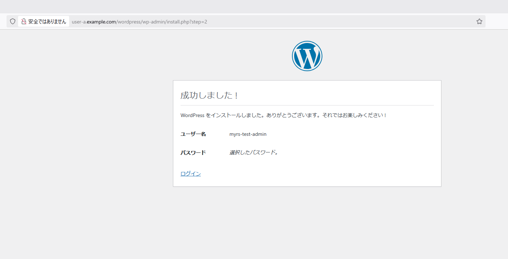

# mysql検証

mysqlを導入しユーザーにDBを払い出すための手順を検証する

DBとユーザーを作成し、ユーザーの権限をそのDBへのアクセスに限定すればよさそう。

## mysqlをインストールする

```
root@myrs-test:~# apt install mysql-server-8.0
Reading package lists... Done
Building dependency tree... Done
Reading state information... Done
The following additional packages will be installed:
  libcgi-fast-perl libcgi-pm-perl libclone-perl libencode-locale-perl libevent-pthreads-2.1-7t64 libfcgi-bin
  libfcgi-perl libfcgi0t64 libhtml-parser-perl libhtml-tagset-perl libhtml-template-perl libhttp-date-perl
  libhttp-message-perl libio-html-perl liblwp-mediatypes-perl libmecab2 libprotobuf-lite32t64 libtimedate-perl
  liburi-perl mecab-ipadic mecab-ipadic-utf8 mecab-utils mysql-client-8.0 mysql-client-core-8.0 mysql-common
  mysql-server-core-8.0
Suggested packages:
  libdata-dump-perl libipc-sharedcache-perl libio-compress-brotli-perl libbusiness-isbn-perl libregexp-ipv6-perl
  libwww-perl mailx tinyca
The following NEW packages will be installed:
  libcgi-fast-perl libcgi-pm-perl libclone-perl libencode-locale-perl libevent-pthreads-2.1-7t64 libfcgi-bin
  libfcgi-perl libfcgi0t64 libhtml-parser-perl libhtml-tagset-perl libhtml-template-perl libhttp-date-perl
  libhttp-message-perl libio-html-perl liblwp-mediatypes-perl libmecab2 libprotobuf-lite32t64 libtimedate-perl
  liburi-perl mecab-ipadic mecab-ipadic-utf8 mecab-utils mysql-client-8.0 mysql-client-core-8.0 mysql-common
  mysql-server-8.0 mysql-server-core-8.0
0 upgraded, 27 newly installed, 0 to remove and 0 not upgraded.
Need to get 29.6 MB of archives.
After this operation, 242 MB of additional disk space will be used.
Do you want to continue? [Y/n] y
Get:1 http://archive.ubuntu.com/ubuntu noble/main amd64 mysql-common all 5.8+1.1.0build1 [6746 B]
Get:2 http://archive.ubuntu.com/ubuntu noble-updates/main amd64 mysql-client-core-8.0 amd64 8.0.41-0ubuntu0.24.04.1 [2727 kB]
Get:3 http://archive.ubuntu.com/ubuntu noble-updates/main amd64 mysql-client-8.0 amd64 8.0.41-0ubuntu0.24.04.1 [22.4 kB]
Get:4 http://archive.ubuntu.com/ubuntu noble/main amd64 libevent-pthreads-2.1-7t64 amd64 2.1.12-stable-9ubuntu2 [7982 B]
Get:5 http://archive.ubuntu.com/ubuntu noble/main amd64 libmecab2 amd64 0.996-14ubuntu4 [201 kB]
Get:6 http://archive.ubuntu.com/ubuntu noble-updates/main amd64 libprotobuf-lite32t64 amd64 3.21.12-8.2ubuntu0.1 [238 kB]
Get:7 http://archive.ubuntu.com/ubuntu noble-updates/main amd64 mysql-server-core-8.0 amd64 8.0.41-0ubuntu0.24.04.1 [17.5 MB]
Get:8 http://archive.ubuntu.com/ubuntu noble-updates/main amd64 mysql-server-8.0 amd64 8.0.41-0ubuntu0.24.04.1 [1432 kB]
Get:9 http://archive.ubuntu.com/ubuntu noble/main amd64 libhtml-tagset-perl all 3.20-6 [11.3 kB]
Get:10 http://archive.ubuntu.com/ubuntu noble/main amd64 liburi-perl all 5.27-1 [88.0 kB]
Get:11 http://archive.ubuntu.com/ubuntu noble/main amd64 libhtml-parser-perl amd64 3.81-1build3 [85.8 kB]
Get:12 http://archive.ubuntu.com/ubuntu noble/main amd64 libcgi-pm-perl all 4.63-1 [185 kB]
Get:13 http://archive.ubuntu.com/ubuntu noble/main amd64 libfcgi0t64 amd64 2.4.2-2.1build1 [26.8 kB]
Get:14 http://archive.ubuntu.com/ubuntu noble/main amd64 libfcgi-perl amd64 0.82+ds-3build2 [21.7 kB]
Get:15 http://archive.ubuntu.com/ubuntu noble/main amd64 libcgi-fast-perl all 1:2.17-1 [10.3 kB]
Get:16 http://archive.ubuntu.com/ubuntu noble/main amd64 libclone-perl amd64 0.46-1build3 [10.7 kB]
Get:17 http://archive.ubuntu.com/ubuntu noble/main amd64 libencode-locale-perl all 1.05-3 [11.6 kB]
Get:18 http://archive.ubuntu.com/ubuntu noble/main amd64 libfcgi-bin amd64 2.4.2-2.1build1 [11.2 kB]
Get:19 http://archive.ubuntu.com/ubuntu noble/main amd64 libhtml-template-perl all 2.97-2 [60.2 kB]
Get:20 http://archive.ubuntu.com/ubuntu noble/main amd64 libtimedate-perl all 2.3300-2 [34.0 kB]
Get:21 http://archive.ubuntu.com/ubuntu noble/main amd64 libhttp-date-perl all 6.06-1 [10.2 kB]
Get:22 http://archive.ubuntu.com/ubuntu noble/main amd64 libio-html-perl all 1.004-3 [15.9 kB]
Get:23 http://archive.ubuntu.com/ubuntu noble/main amd64 liblwp-mediatypes-perl all 6.04-2 [20.1 kB]
Get:24 http://archive.ubuntu.com/ubuntu noble/main amd64 libhttp-message-perl all 6.45-1ubuntu1 [78.2 kB]
Get:25 http://archive.ubuntu.com/ubuntu noble/main amd64 mecab-utils amd64 0.996-14ubuntu4 [4804 B]
Get:26 http://archive.ubuntu.com/ubuntu noble/main amd64 mecab-ipadic all 2.7.0-20070801+main-3 [6718 kB]
Get:27 http://archive.ubuntu.com/ubuntu noble/main amd64 mecab-ipadic-utf8 all 2.7.0-20070801+main-3 [4384 B]
Fetched 29.6 MB in 3s (9501 kB/s)
Preconfiguring packages ...
Selecting previously unselected package mysql-common.
(Reading database ... 37521 files and directories currently installed.)
Preparing to unpack .../0-mysql-common_5.8+1.1.0build1_all.deb ...
Unpacking mysql-common (5.8+1.1.0build1) ...
Selecting previously unselected package mysql-client-core-8.0.
Preparing to unpack .../1-mysql-client-core-8.0_8.0.41-0ubuntu0.24.04.1_amd64.deb ...
Unpacking mysql-client-core-8.0 (8.0.41-0ubuntu0.24.04.1) ...
Selecting previously unselected package mysql-client-8.0.
Preparing to unpack .../2-mysql-client-8.0_8.0.41-0ubuntu0.24.04.1_amd64.deb ...
Unpacking mysql-client-8.0 (8.0.41-0ubuntu0.24.04.1) ...
Selecting previously unselected package libevent-pthreads-2.1-7t64:amd64.
Preparing to unpack .../3-libevent-pthreads-2.1-7t64_2.1.12-stable-9ubuntu2_amd64.deb ...
Unpacking libevent-pthreads-2.1-7t64:amd64 (2.1.12-stable-9ubuntu2) ...
Selecting previously unselected package libmecab2:amd64.
Preparing to unpack .../4-libmecab2_0.996-14ubuntu4_amd64.deb ...
Unpacking libmecab2:amd64 (0.996-14ubuntu4) ...
Selecting previously unselected package libprotobuf-lite32t64:amd64.
Preparing to unpack .../5-libprotobuf-lite32t64_3.21.12-8.2ubuntu0.1_amd64.deb ...
Unpacking libprotobuf-lite32t64:amd64 (3.21.12-8.2ubuntu0.1) ...
Selecting previously unselected package mysql-server-core-8.0.
Preparing to unpack .../6-mysql-server-core-8.0_8.0.41-0ubuntu0.24.04.1_amd64.deb ...
Unpacking mysql-server-core-8.0 (8.0.41-0ubuntu0.24.04.1) ...
Setting up mysql-common (5.8+1.1.0build1) ...
update-alternatives: using /etc/mysql/my.cnf.fallback to provide /etc/mysql/my.cnf (my.cnf) in auto mode
Selecting previously unselected package mysql-server-8.0.
(Reading database ... 37740 files and directories currently installed.)
Preparing to unpack .../00-mysql-server-8.0_8.0.41-0ubuntu0.24.04.1_amd64.deb ...
Unpacking mysql-server-8.0 (8.0.41-0ubuntu0.24.04.1) ...
Selecting previously unselected package libhtml-tagset-perl.
Preparing to unpack .../01-libhtml-tagset-perl_3.20-6_all.deb ...
Unpacking libhtml-tagset-perl (3.20-6) ...
Selecting previously unselected package liburi-perl.
Preparing to unpack .../02-liburi-perl_5.27-1_all.deb ...
Unpacking liburi-perl (5.27-1) ...
Selecting previously unselected package libhtml-parser-perl:amd64.
Preparing to unpack .../03-libhtml-parser-perl_3.81-1build3_amd64.deb ...
Unpacking libhtml-parser-perl:amd64 (3.81-1build3) ...
Selecting previously unselected package libcgi-pm-perl.
Preparing to unpack .../04-libcgi-pm-perl_4.63-1_all.deb ...
Unpacking libcgi-pm-perl (4.63-1) ...
Selecting previously unselected package libfcgi0t64:amd64.
Preparing to unpack .../05-libfcgi0t64_2.4.2-2.1build1_amd64.deb ...
Unpacking libfcgi0t64:amd64 (2.4.2-2.1build1) ...
Selecting previously unselected package libfcgi-perl.
Preparing to unpack .../06-libfcgi-perl_0.82+ds-3build2_amd64.deb ...
Unpacking libfcgi-perl (0.82+ds-3build2) ...
Selecting previously unselected package libcgi-fast-perl.
Preparing to unpack .../07-libcgi-fast-perl_1%3a2.17-1_all.deb ...
Unpacking libcgi-fast-perl (1:2.17-1) ...
Selecting previously unselected package libclone-perl:amd64.
Preparing to unpack .../08-libclone-perl_0.46-1build3_amd64.deb ...
Unpacking libclone-perl:amd64 (0.46-1build3) ...
Selecting previously unselected package libencode-locale-perl.
Preparing to unpack .../09-libencode-locale-perl_1.05-3_all.deb ...
Unpacking libencode-locale-perl (1.05-3) ...
Selecting previously unselected package libfcgi-bin.
Preparing to unpack .../10-libfcgi-bin_2.4.2-2.1build1_amd64.deb ...
Unpacking libfcgi-bin (2.4.2-2.1build1) ...
Selecting previously unselected package libhtml-template-perl.
Preparing to unpack .../11-libhtml-template-perl_2.97-2_all.deb ...
Unpacking libhtml-template-perl (2.97-2) ...
Selecting previously unselected package libtimedate-perl.
Preparing to unpack .../12-libtimedate-perl_2.3300-2_all.deb ...
Unpacking libtimedate-perl (2.3300-2) ...
Selecting previously unselected package libhttp-date-perl.
Preparing to unpack .../13-libhttp-date-perl_6.06-1_all.deb ...
Unpacking libhttp-date-perl (6.06-1) ...
Selecting previously unselected package libio-html-perl.
Preparing to unpack .../14-libio-html-perl_1.004-3_all.deb ...
Unpacking libio-html-perl (1.004-3) ...
Selecting previously unselected package liblwp-mediatypes-perl.
Preparing to unpack .../15-liblwp-mediatypes-perl_6.04-2_all.deb ...
Unpacking liblwp-mediatypes-perl (6.04-2) ...
Selecting previously unselected package libhttp-message-perl.
Preparing to unpack .../16-libhttp-message-perl_6.45-1ubuntu1_all.deb ...
Unpacking libhttp-message-perl (6.45-1ubuntu1) ...
Selecting previously unselected package mecab-utils.
Preparing to unpack .../17-mecab-utils_0.996-14ubuntu4_amd64.deb ...
Unpacking mecab-utils (0.996-14ubuntu4) ...
Selecting previously unselected package mecab-ipadic.
Preparing to unpack .../18-mecab-ipadic_2.7.0-20070801+main-3_all.deb ...
Unpacking mecab-ipadic (2.7.0-20070801+main-3) ...
Selecting previously unselected package mecab-ipadic-utf8.
Preparing to unpack .../19-mecab-ipadic-utf8_2.7.0-20070801+main-3_all.deb ...
Unpacking mecab-ipadic-utf8 (2.7.0-20070801+main-3) ...
Setting up libprotobuf-lite32t64:amd64 (3.21.12-8.2ubuntu0.1) ...
Setting up libmecab2:amd64 (0.996-14ubuntu4) ...
Setting up mysql-client-core-8.0 (8.0.41-0ubuntu0.24.04.1) ...
Setting up libclone-perl:amd64 (0.46-1build3) ...
Setting up libevent-pthreads-2.1-7t64:amd64 (2.1.12-stable-9ubuntu2) ...
Setting up libfcgi0t64:amd64 (2.4.2-2.1build1) ...
Setting up libhtml-tagset-perl (3.20-6) ...
Setting up liblwp-mediatypes-perl (6.04-2) ...
Setting up libfcgi-bin (2.4.2-2.1build1) ...
Setting up libencode-locale-perl (1.05-3) ...
Setting up mecab-utils (0.996-14ubuntu4) ...
Setting up libio-html-perl (1.004-3) ...
Setting up mysql-server-core-8.0 (8.0.41-0ubuntu0.24.04.1) ...
Setting up libtimedate-perl (2.3300-2) ...
Setting up mysql-client-8.0 (8.0.41-0ubuntu0.24.04.1) ...
Setting up libfcgi-perl (0.82+ds-3build2) ...
Setting up liburi-perl (5.27-1) ...
Setting up mysql-server-8.0 (8.0.41-0ubuntu0.24.04.1) ...
update-alternatives: using /etc/mysql/mysql.cnf to provide /etc/mysql/my.cnf (my.cnf) in auto mode
Renaming removed key_buffer and myisam-recover options (if present)
mysqld will log errors to /var/log/mysql/error.log
mysqld is running as pid 8887
Created symlink /etc/systemd/system/multi-user.target.wants/mysql.service → /usr/lib/systemd/system/mysql.service.
Setting up libhttp-date-perl (6.06-1) ...
Setting up mecab-ipadic (2.7.0-20070801+main-3) ...
Compiling IPA dictionary for Mecab.  This takes long time...
reading /usr/share/mecab/dic/ipadic/unk.def ... 40
emitting double-array: 100% |###########################################|
/usr/share/mecab/dic/ipadic/model.def is not found. skipped.
reading /usr/share/mecab/dic/ipadic/Postp.csv ... 146
reading /usr/share/mecab/dic/ipadic/Conjunction.csv ... 171
reading /usr/share/mecab/dic/ipadic/Noun.org.csv ... 16668
reading /usr/share/mecab/dic/ipadic/Interjection.csv ... 252
reading /usr/share/mecab/dic/ipadic/Noun.adverbal.csv ... 795
reading /usr/share/mecab/dic/ipadic/Prefix.csv ... 221
reading /usr/share/mecab/dic/ipadic/Noun.proper.csv ... 27328
reading /usr/share/mecab/dic/ipadic/Noun.verbal.csv ... 12146
reading /usr/share/mecab/dic/ipadic/Noun.demonst.csv ... 120
reading /usr/share/mecab/dic/ipadic/Adnominal.csv ... 135
reading /usr/share/mecab/dic/ipadic/Noun.number.csv ... 42
reading /usr/share/mecab/dic/ipadic/Adverb.csv ... 3032
reading /usr/share/mecab/dic/ipadic/Verb.csv ... 130750
reading /usr/share/mecab/dic/ipadic/Others.csv ... 2
reading /usr/share/mecab/dic/ipadic/Noun.others.csv ... 151
reading /usr/share/mecab/dic/ipadic/Noun.name.csv ... 34202
reading /usr/share/mecab/dic/ipadic/Auxil.csv ... 199
reading /usr/share/mecab/dic/ipadic/Noun.place.csv ... 72999
reading /usr/share/mecab/dic/ipadic/Noun.csv ... 60477
reading /usr/share/mecab/dic/ipadic/Suffix.csv ... 1393
reading /usr/share/mecab/dic/ipadic/Filler.csv ... 19
reading /usr/share/mecab/dic/ipadic/Symbol.csv ... 208
reading /usr/share/mecab/dic/ipadic/Noun.nai.csv ... 42
reading /usr/share/mecab/dic/ipadic/Postp-col.csv ... 91
reading /usr/share/mecab/dic/ipadic/Adj.csv ... 27210
reading /usr/share/mecab/dic/ipadic/Noun.adjv.csv ... 3328
emitting double-array: 100% |###########################################|
reading /usr/share/mecab/dic/ipadic/matrix.def ... 1316x1316
emitting matrix      : 100% |###########################################|

done!
update-alternatives: using /var/lib/mecab/dic/ipadic to provide /var/lib/mecab/dic/debian (mecab-dictionary) in auto mode
Setting up mecab-ipadic-utf8 (2.7.0-20070801+main-3) ...
Compiling IPA dictionary for Mecab.  This takes long time...
reading /usr/share/mecab/dic/ipadic/unk.def ... 40
emitting double-array: 100% |###########################################|
/usr/share/mecab/dic/ipadic/model.def is not found. skipped.
reading /usr/share/mecab/dic/ipadic/Postp.csv ... 146
reading /usr/share/mecab/dic/ipadic/Conjunction.csv ... 171
reading /usr/share/mecab/dic/ipadic/Noun.org.csv ... 16668
reading /usr/share/mecab/dic/ipadic/Interjection.csv ... 252
reading /usr/share/mecab/dic/ipadic/Noun.adverbal.csv ... 795
reading /usr/share/mecab/dic/ipadic/Prefix.csv ... 221
reading /usr/share/mecab/dic/ipadic/Noun.proper.csv ... 27328
reading /usr/share/mecab/dic/ipadic/Noun.verbal.csv ... 12146
reading /usr/share/mecab/dic/ipadic/Noun.demonst.csv ... 120
reading /usr/share/mecab/dic/ipadic/Adnominal.csv ... 135
reading /usr/share/mecab/dic/ipadic/Noun.number.csv ... 42
reading /usr/share/mecab/dic/ipadic/Adverb.csv ... 3032
reading /usr/share/mecab/dic/ipadic/Verb.csv ... 130750
reading /usr/share/mecab/dic/ipadic/Others.csv ... 2
reading /usr/share/mecab/dic/ipadic/Noun.others.csv ... 151
reading /usr/share/mecab/dic/ipadic/Noun.name.csv ... 34202
reading /usr/share/mecab/dic/ipadic/Auxil.csv ... 199
reading /usr/share/mecab/dic/ipadic/Noun.place.csv ... 72999
reading /usr/share/mecab/dic/ipadic/Noun.csv ... 60477
reading /usr/share/mecab/dic/ipadic/Suffix.csv ... 1393
reading /usr/share/mecab/dic/ipadic/Filler.csv ... 19
reading /usr/share/mecab/dic/ipadic/Symbol.csv ... 208
reading /usr/share/mecab/dic/ipadic/Noun.nai.csv ... 42
reading /usr/share/mecab/dic/ipadic/Postp-col.csv ... 91
reading /usr/share/mecab/dic/ipadic/Adj.csv ... 27210
reading /usr/share/mecab/dic/ipadic/Noun.adjv.csv ... 3328
emitting double-array: 100% |###########################################|
reading /usr/share/mecab/dic/ipadic/matrix.def ... 1316x1316
emitting matrix      : 100% |###########################################|

done!
update-alternatives: using /var/lib/mecab/dic/ipadic-utf8 to provide /var/lib/mecab/dic/debian (mecab-dictionary) in aut
o mode
Setting up libhtml-parser-perl:amd64 (3.81-1build3) ...
Setting up libhttp-message-perl (6.45-1ubuntu1) ...
Setting up libcgi-pm-perl (4.63-1) ...
Setting up libhtml-template-perl (2.97-2) ...
Setting up libcgi-fast-perl (1:2.17-1) ...
Processing triggers for man-db (2.12.0-4build2) ...
Processing triggers for libc-bin (2.39-0ubuntu8.4) ...
Scanning processes...                                                                                                   
No services need to be restarted.

No containers need to be restarted.

No user sessions are running outdated binaries.

No VM guests are running outdated hypervisor (qemu) binaries on this host.
```

## 設定

php-fpmと同居するのと、とりあえず使えたらよいので特に変更しない。

## データベースを作成する

初期はこんな感じ。
```
root@myrs-test:~# mysql -u root
Welcome to the MySQL monitor.  Commands end with ; or \g.
Your MySQL connection id is 12
Server version: 8.0.41-0ubuntu0.24.04.1 (Ubuntu)

Copyright (c) 2000, 2025, Oracle and/or its affiliates.

Oracle is a registered trademark of Oracle Corporation and/or its
affiliates. Other names may be trademarks of their respective
owners.

Type 'help;' or '\h' for help. Type '\c' to clear the current input statement.

mysql> show databases;
+--------------------+
| Database           |
+--------------------+
| information_schema |
| mysql              |
| performance_schema |
| sys                |
+--------------------+
4 rows in set (0.01 sec)
```

```
mysql> CREATE DATABASE `user-a`;
Query OK, 1 row affected (0.02 sec)

mysql> show databases;
+--------------------+
| Database           |
+--------------------+
| information_schema |
| mysql              |
| performance_schema |
| sys                |
| user-a             |
+--------------------+
5 rows in set (0.00 sec)
```

データベース`user-a`に接続できるユーザーを作成する。
また認証方式をauth_socketにしてみる。
```
mysql> CREATE USER 'user-a'@'localhost' IDENTIFIED WITH auth_socket;
Query OK, 0 rows affected (0.01 sec)
```

LinuxのrootユーザーでMySQLのuser-aでログインしようとするとエラーで接続できないことを確認できる。
Linuxのuser-aでMySQLのuser-aでログインできることを確認できる。
```
root@myrs-test:~# mysql -u user-a
ERROR 1698 (28000): Access denied for user 'user-a'@'localhost'
root@myrs-test:~# mysql -u user-a^C
root@myrs-test:~# su - user-a
user-a@myrs-test:~$ mysql -u user-a
Welcome to the MySQL monitor.  Commands end with ; or \g.
Your MySQL connection id is 14
Server version: 8.0.41-0ubuntu0.24.04.1 (Ubuntu)

Copyright (c) 2000, 2025, Oracle and/or its affiliates.

Oracle is a registered trademark of Oracle Corporation and/or its
affiliates. Other names may be trademarks of their respective
owners.

Type 'help;' or '\h' for help. Type '\c' to clear the current input statement.

mysql>
```

今のままではuser-aには何も権限がついてないのでuser-aデータベースにアクセスできるように権限を付与する。

```
mysql> GRANT ALL ON `user-a`.* TO 'user-a'@'localhost';
Query OK, 0 rows affected (0.01 sec)
```

## WordPressで使えるか?

WordPressをuser-aに入れてみます。

```
user-a@myrs-test:~$ curl -O https://ja.wordpress.org/latest-ja.zip
user-a@myrs-test:~$ unzip latest-ja.zip
user-a@myrs-test:~$ mv wordpress/ www/
```

http://user-a.example.com/wordpress/にアクセスするとmysqliのモジュールがないというエラーに。


php8.3-mysqlを入れた。
```
root@myrs-test:~# apt install php8.3-mysql
```

WordPressのセットアップ画面にアクセスできた。


dbの設定を入れる。
auth_socketのためパスワードは空にしてみる。


実行ボタンが出てくる


サイトの設定を入れる


メールが必須だった


インストールが成功した



ログインできた


記事を書いてみる。


うまく表示できてる

